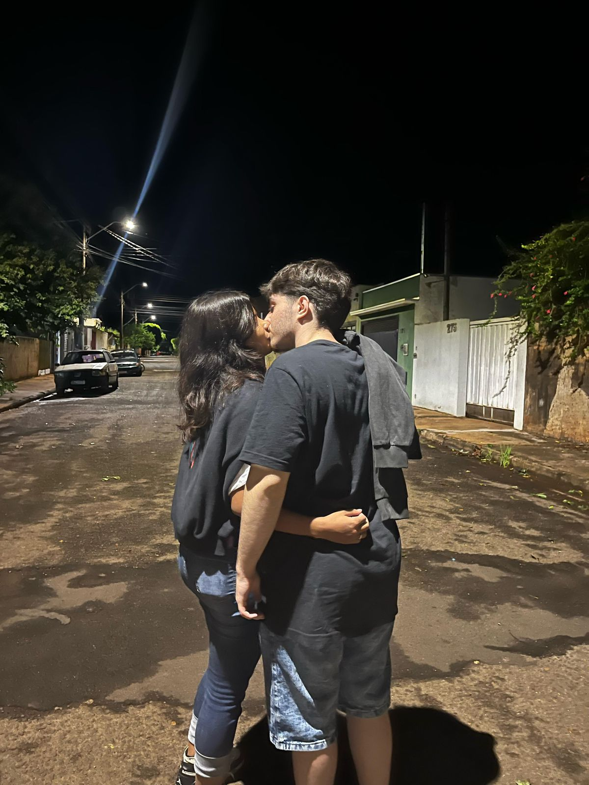
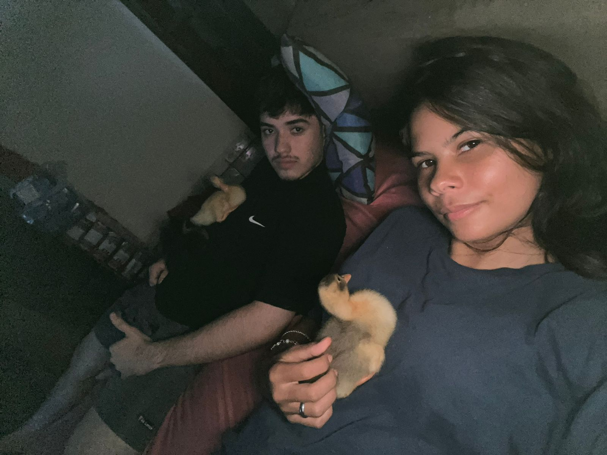
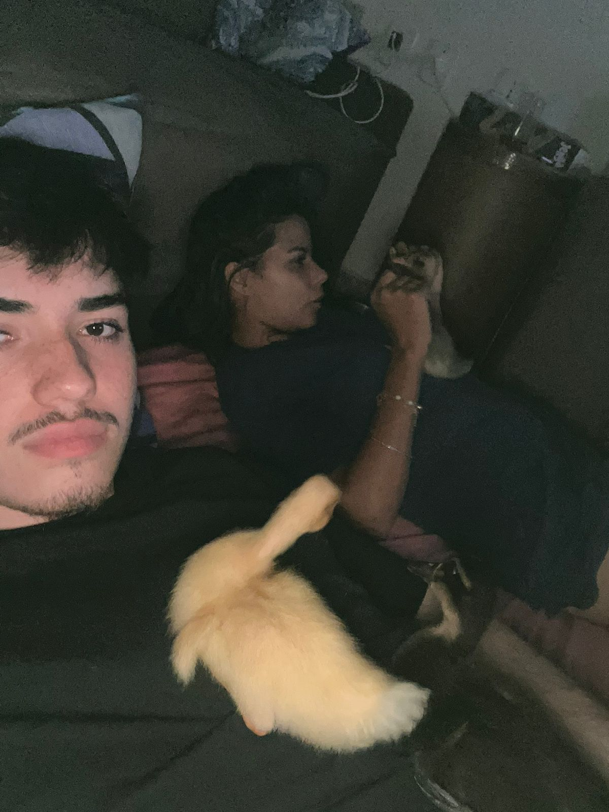
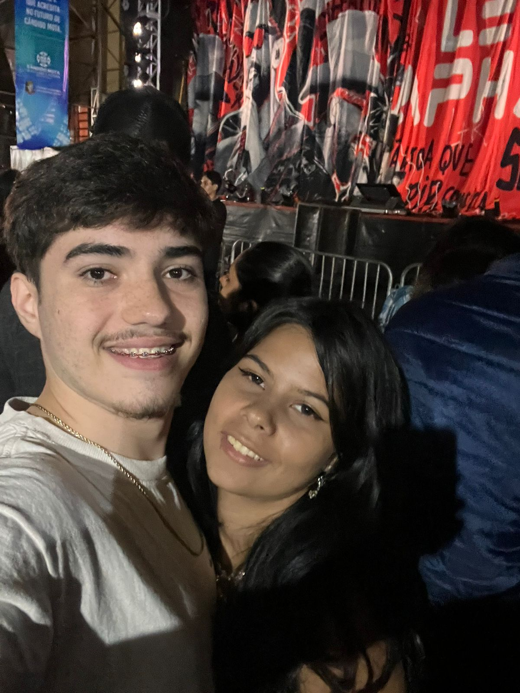
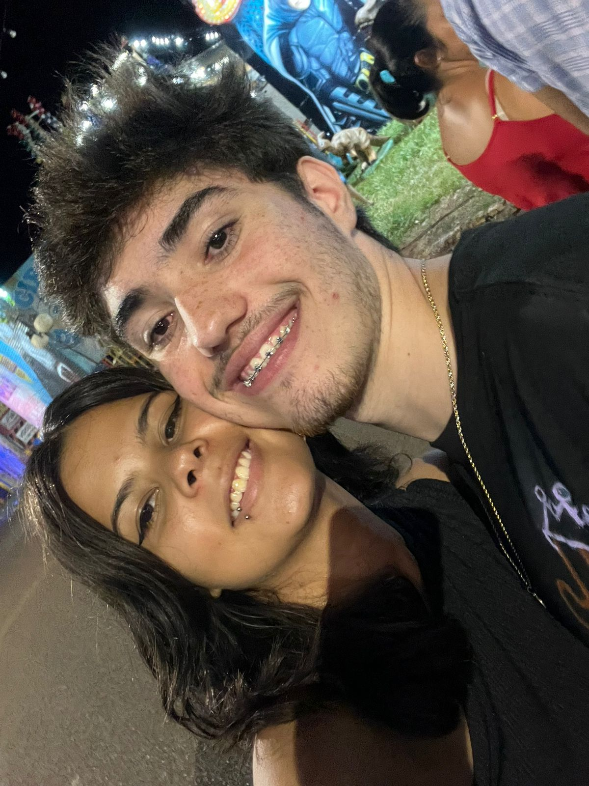

<html lang="pt-br">
<head>
    <meta charset="UTF-8">
    <meta name="viewport" content="width=device-width, initial-scale=1.0">
    <title>Para Jhoyssili, Com Todo Meu Amor</title>
    
    <link rel="stylesheet" href="https://cdnjs.cloudflare.com/ajax/libs/font-awesome/6.0.0-beta3/css/all.min.css">
</head>
<body>
    

    
    <audio id="bgMusic" loop>
        <!-- Substitua pelo seu arquivo de música -->
        <source src="msc/Stephen Sanchez, Em Beihold - Until I Found You (Lyrics) - 192.mp3" type="audio/mpeg">
        Seu navegador não suporta áudio HTML5.
    </audio>
    
    

        <i class="fas fa-music"></i>
    

    
    

        

            <h1>Para Jhoyssili</h1>
            
Clique abaixo para abrir minha carta de amor

            <button class="btn-open" id="btnOpen">
                Abrir Carta do Seu Amor <i class="fas fa-heart"></i>
            </button>
        

    

    
    

        <section class="memory">
            <h2>Por que você é especial</h2>
            
Você é especial porque traz luz aos meus dias simples e transforma momentos comuns em memórias inesquecíveis. Seu sorriso é meu lugar favorito, seu abraço é meu porto seguro, e sua voz é a melodia que acalma minha alma.
Você me ensinou que o amor não é só sentir, mas escolher todos os dias estar presente, cuidar, entender e celebrar até os pequenos detalhes. Com você, aprendi que a vida fica mais bonita quando compartilhada, e que os desafios ficam mais leves quando enfrentados juntos.

        </section>
        
        <section class="memory">
            <h2>Nossa História</h2>
            
Lembro do dia em que sua amiga veio até mim pedir meu número. Achei curioso, pois ainda não te conhecia. Quando nos vimos na ETEC, fiquei tão nervoso que você teve que falar primeiro. Nosso primeiro encontro foi mágico - você era tão adorável e atenciosa que eu já sabia que era especial. E aquele primeiro beijo? Foi perfeito!

            
        </section>
        
        <section class="memory">
            <h2>Memórias Felizes</h2>
            
Lembro perfeitamente daquele dia em que sua amiga veio até mim pedir meu número para você. Confesso que achei estranho, pois ainda não te conhecia, mas algo me disse que valeria a pena descobrir quem era você.

Quando nos encontramos pela primeira vez na ETEC, fiquei tão nervoso que nem conseguia falar direito foi você quem teve a coragem de puxar assunto, e eu só agradeço por isso. Depois, quando saímos, tudo mudou. Aquele dia foi mágico: descobri uma pessoa incrivelmente adorável, atenciosa e cheia de luz. E, quando rolou nosso primeiro beijo, meu coração disparou de felicidade. Eu sabia, naquele momento, que você era alguém especial.

Nos meses seguintes, cada saída, cada risada, cada conversa no telefone até tarde só confirmou o que eu já sentia. Até que, um dia, tomei coragem e pedi sua mão em namoro. Quando você disse "sim", foi uma das melhores sensações da minha vida.

Hoje, olhando para trás, só tenho gratidão por cada segundo ao seu lado. Obrigado por me amar, por me entender e por fazer da minha vida uma história mais bonita. Eu te amo mais do que as palavras podem dizer. ❤️

            
            

                
                
                
                
            

        </section>
        
        <section class="memory">
            <h2>Minhas Promessas Para Você</h2>
            

                1. Prometo te amar incondicionalmente, nos dias bons e ruins 
                2. Prometo ser seu porto seguro sempre que precisar 
                3. Prometo cultivar nossa paixão e nunca deixar o amor virar rotina 
                4. Prometo apoiar seus sonhos como você apoia os meus 
                5. Prometo lembrar sempre daquele primeiro beijo e manter a magia viva
            

        </section>
        
        <section class="memory">
            <h2>Mensagem Final</h2>
            
Se eu pudesse resumir o que sinto em uma só palavra, ela seria "gratidão" gratidão por cada olhar, cada risada, cada momento em que você me mostrou que o amor pode ser tão simples e, ao mesmo tempo, tão grandioso.

Você chegou na minha vida de um jeito inesperado, mas hoje sei que nada foi por acaso. Desde aquele primeiro beijo até os nossos planos mais secretos, cada dia ao seu lado me ensinou que o amor verdadeiro não é só paixão: é parceria, é cumplicidade, é encontrar no outro o lar que a gente nem sabia que procurava.

Você é minha paz no caos, minha alegria nos dias cinzentos, a pessoa que me faz acreditar que o mundo pode ser melhor só porque existe. Não importa o que o futuro traga, eu quero enfrentar tudo com você de mãos dadas, como sempre fizemos.

Obrigado por ser quem você é. Obrigado por me escolher todos os dias. Obrigado por esse amor que não cabe em palavras, mas que eu tento mostrar em cada "bom dia", em cada abraço, em cada "te amo" sussurrado no seu ouvido.

Eu te amo hoje mais do que ontem, mas menos do que amanhã. E prometo continuar provando isso até o último dos nossos "para sempre".

De 💖 Gabriel

        </section>
    

    
    <footer>
        
Feito com ♥ por Gabriel em 

    </footer>
    
    
</body>
</html>
